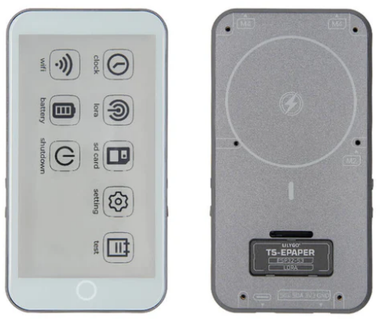
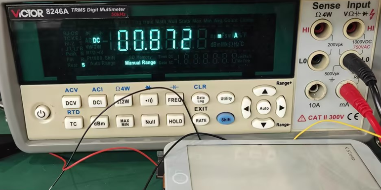

<h1 align = "center">🏆T5_E_Paper_S3_Pro🏆</h1>

 
  
  
  
  

## :zero: Version 🎁

### 1、Version

|                                       ID                                       |  Hardware   |  Software   | Remark  |
| :----------------------------------------------------------------------------: | :---------: | :---------: | :----:  |
| [H752-01](https://github.com/Xinyuan-LilyGO/T5S3-4.7-e-paper-PRO/tree/H752-01) | v1.0-241224 | v1.2_250118 | latest  |
|    [H752](https://github.com/Xinyuan-LilyGO/T5S3-4.7-e-paper-PRO/tree/H752)    | v1.0-240810 | v1.0-241203 | current |

### 2、Where to buy.

[LilyGo Store](https://lilygo.cc/products/t5-e-paper-s3-pro)

## :one:Product 🎁

|     Product      | [T5 E-Paper S3 Pro](https://lilygo.cc/products/t5-e-paper-s3-pro) |
| :--------------: | :---------------------------------------------------------------: |
|       MCU        |                         ESP32-S3-WROOM-1                          |
|  Flash / PSRAM   |                             16M / 8M                              |
|       Lora       |                              SX1262                               |
|      Touch       |                           GT911 (0x5D)                            |
|    Driver IC     |             ED047TC1 (4.7 inches, 960x540 , 16 gray)              |
| Battery Capacity |                              1500mAh                              |
|   Battery Chip   |                  BQ25896 (0x6B), BQ27220 (0x55)                   |
|       RTC        |                          PCF85063 (0x51)                          |

## :two: Module 🎁

Datasheets on the chip are available in [./hardware](./hardware/) directory.

|  Name   |                            Dependency library                            |
| :-----: | :----------------------------------------------------------------------: |
| SX1262  |      [jgromes/RadioLib@6.5.0](https://github.com/jgromes/RadioLib)       |
| BQ25896 |   [lewisxhe/XPowersLib@^0.2.3](https://github.com/lewisxhe/XPowersLib)   |
| Sensor  |    [lewisxhe/SensorLib@0.2.2](https://github.com/lewisxhe/SensorsLib)    |
|  LVGL   |      [lvgl/lvgl@^8.3.11](https://github.com/lvgl/lvgl/tree/v8.3.11)      |

## :three: Quick Start 🎁

🟢 PlatformIO is recommended because these examples were developed on it. 🟢 

### 1、PlatformIO

1. Install [Visual Studio Code](https://code.visualstudio.com/) and [Python](https://www.python.org/), and clone or download the project;
2. Search for the `PlatformIO` plugin in the `VisualStudioCode` extension and install it;
3. After the installation is complete, you need to restart `VisualStudioCode`
4. After opening this project, PlatformIO will automatically download the required tripartite libraries and dependencies, the first time this process is relatively long, please wait patiently;
5. After all the dependencies are installed, you can open the `platformio.ini` configuration file, uncomment in `example` to select a routine, and then press `ctrl+s` to save the `.ini` configuration file;
6. Click :ballot_box_with_check: under VScode to compile the project, then plug in USB and select COM under VScode;
7. Finally, click the :arrow_right:  button to download the program to Flash;

### 2、Arduino IDE

1. Install [Arduino IDE](https://www.arduino.cc/en/software)

2. Copy all files under `this project/lib/` and paste them into the Arduion library path (generally `C:\Users\YourName\Documents\Arduino\libraries`);

3. Open the Arduion IDE and click `File->Open` in the upper left corner to open an example in `this project/example/xxx/xxx.ino` under this item;

4. Then configure Arduion. After the configuration is completed in the following way, you can click the button in the upper left corner of Arduion to compile and download;

| Arduino IDE Setting                  | Value                              |
| ------------------------------------ | ---------------------------------- |
| Board                                | ***ESP32S3 Dev Module***           |
| Port                                 | Your port                          |
| USB CDC On Boot                      | Enable                             |
| CPU Frequency                        | 240MHZ(WiFi)                       |
| Core Debug Level                     | None                               |
| USB DFU On Boot                      | Disable                            |
| Erase All Flash Before Sketch Upload | Disable                            |
| Events Run On                        | Core1                              |
| Flash Mode                           | QIO 80MHZ                          |
| Flash Size                           | **16MB(128Mb)**                    |
| Arduino Runs On                      | Core1                              |
| USB Firmware MSC On Boot             | Disable                            |
| Partition Scheme                     | **16M Flash(3M APP/9.9MB FATFS)**  |
| PSRAM                                | **OPI PSRAM**                      |
| Upload Mode                          | **UART0/Hardware CDC**             |
| Upload Speed                         | 921600                             |
| USB Mode                             | **CDC and JTAG**                   |

### 3、Folder structure:

~~~
├─boards  : Some information about the board for the platformio.ini configuration project;
├─data    : Picture resources used by the program;
├─example : Some examples;
├─firmare : `factory` compiled firmware;
├─hardware: Schematic diagram of the board, chip data;
├─lib     : Libraries used in the project;

~~~

### 4、Examples

~~~
 -✅ bq25896：bq25896 test
 -✅ bq27220：bq27220 test
 -✅ display_test：Ink screen display test.
 -✅ factory：Factory firmware program.
 -✅ GPS：The GPS test needs to be done outdoors.
 -✅ io_extend：IO expansion chip test.
 -✅ lora_recv：SX1262 LoRa send test.
 -✅ lora_send：SX1262 LoRa recv test.
 -✅ lvgl_test：Test using LVGL as image engine.
 -✅ rtc_pcf8563：Real-time clock chip test.
 -✅ sd_card：SD card read test.
 -✅ touch：GT911 test.
~~~

## :four: Pins 🎁

~~~c
#define BOARD_SCL         (5)
#define BOARD_SDA         (6)

#define BOARD_SPI_MISO    (8)
#define BOARD_SPI_MOSI    (17)
#define BOARD_SPI_SCLK    (18)

#define BOARD_SD_MISO    (BOARD_SPI_MISO)
#define BOARD_SD_MOSI    (BOARD_SPI_MOSI)
#define BOARD_SD_SCLK    (BOARD_SPI_SCLK)
#define BOARD_SD_CS      (16)

#define BOARD_LORA_MISO   (BOARD_SPI_MISO)
#define BOARD_LORA_MOSI   (BOARD_SPI_MOSI)
#define BOARD_LORA_SCLK   (BOARD_SPI_SCLK)
#define BOARD_LORA_CS     (46)
#define BOARD_LORA_IRQ    (3)
#define BOARD_LORA_RST    (43)
#define BOARD_LORA_BUSY   (44)

#define BOARD_TOUCH_SCL   (BOARD_SCL)
#define BOARD_TOUCH_SDA   (BOARD_SDA)
#define BOARD_TOUCH_INT   (15)
#define BOARD_TOUCH_RST   (41)

#define BOARD_RTC_INT     7
#define BOARD_RT_SCL      (BOARD_SCL)
#define BOARD_RT_SDA      (BOARD_SDA)

#define BOARD_BL_EN       (40)
#define BOARD_BATT_PIN    (4)
#define BOARD_BOOT_BTN    (0)
#define BOARD_KEY_BTN     (48)
~~~

## :five: Test 🎁

Sleep power consumption.

## :six: FAQ 🎁

|                         Document                         |                           Link                            |
| :------------------------------------------------------: | :-------------------------------------------------------: |
| How to download programs through `flash_download_tool` ? | [dosc](./docs/flash_download_tool/flash_download_tool.md) |

## :seven: Schematic & 3D 🎁

For more information, see the `./hardware` directory.

Schematic : [T5_E-Paper-S3-Pro](./hardware/T5%20E-paper%20S3%20Pro%20V1.0%2024-12-24.pdf)

3D Files : [3D Files](./DXF/)

